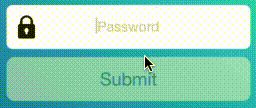

# UDProgress Button
A simple UIButton subclass with inbuilt activity indicator to show loading or task in progress.



## Installation
Drag and drop the file into your project folder.
Make sure **Copy Files** is checked and file is added to target.

## About

##### Properties
- progressColor - Determines the color of activity indicator. Default is white.
Can be changed from storyboard. Property is IBInspectable.
- style - enum representing UIActivityIndicatorStyle. Default is .white
- isAnimating - Returns true|false. True when inidicator is animating.

##### Methods
- startAnimating() - Disables user interaction and shows activity indicator.
- stopAnimating() - Enables user interaction and hides activity indicator.
- set(enabled: Bool) - Enables the user interaction of button and changes the alpha but don't show/hide activity indicator.

*Keep in mind to show/hide indicator on the main thread.*
> Note: When loader is animating, alpha of button is set to 0.5 to give a fade out effect.

## Usage

##### Using Storyboard
Change the class of button to **UDProgressButton** in Identity inspector.
Create **@IBOultet** and access properties and methods.

##### Using code
```
let frame = CGRect(x: 0, y:0, width: 175.0, height: 50.0)
let button = UDProgressButton(frame: frame)
button.progressColor = .red
```
```
button.startAnimating()
APIManager.login(email: "xyz@zap.com") {
  [weak self] (success) in
  if success {
    DispatchQueue.main.async {
      self?.button.stopAnimating()
    }
  }
}
```

##
Thanks for using the widget 🙏
